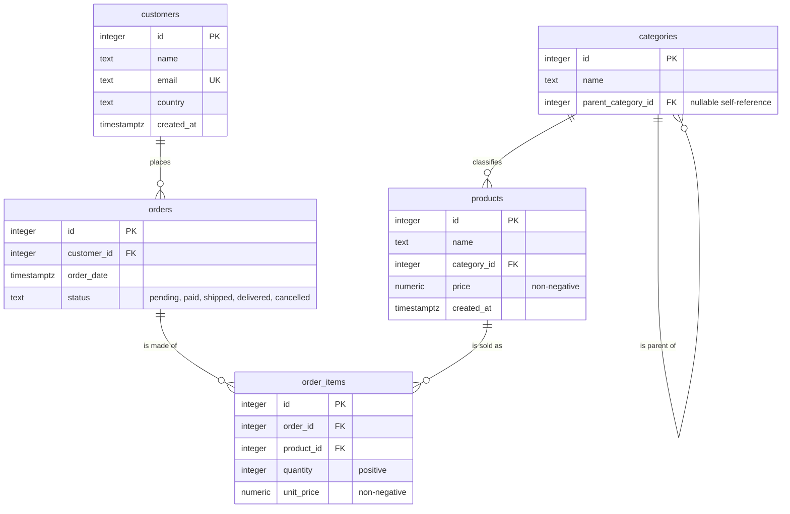

# Schema diagram

The sqlcraft dataset is a simplified but realistic e-commerce model: customers place
orders, orders are made of line items, line items point at products, and products are
organised in a nested category tree.

The diagram below mirrors [`sql/00-schema.sql`](../sql/00-schema.sql).



## Tables

| Table | Purpose |
|-------|---------|
| **customers** | People who place orders. `email` is unique; `country` drives the geographic breakdowns in `02-basics.sql`. |
| **categories** | Product taxonomy. `parent_category_id` references `categories.id` and is `NULL` for root categories, forming an arbitrarily deep tree. |
| **products** | Items for sale, each attached to exactly one category. The seed attaches products to **leaf** categories only. |
| **orders** | A purchase placed by a customer, with a lifecycle `status`. Cancelled orders are excluded from revenue throughout the query files. |
| **order_items** | Line items of an order. `unit_price` is captured at order time, so it can differ from the product's current `price`. This is the largest table (~26k rows). |

## Relationships

- **customers → orders** (1:N) — a customer places many orders; every order belongs to one customer.
- **orders → order_items** (1:N) — an order is made of one or more line items.
- **products → order_items** (1:N) — a product appears in many line items.
- **categories → products** (1:N) — a category classifies many products.
- **categories → categories** (1:N, self-referencing) — a category can be the parent of many sub-categories. This is the recursion exploited by [`sql/04-cte-recursive.sql`](../sql/04-cte-recursive.sql), which walks the tree both **up** (a product's full breadcrumb) and **down** (every product under a branch).

The seed builds a three-level backbone, for example:

```
Electronics
└── Computers
    └── Laptops
```

## Indexes

Every foreign key is indexed in `00-schema.sql` — **except `order_items(order_id)`**, which is
deliberately left out. That single omission is what
[`sql/05-optimisation.sql`](../sql/05-optimisation.sql) uses to demonstrate a real
`EXPLAIN ANALYZE` before/after: a full `Seq Scan` of `order_items` collapses into an
`Index Scan` once the index is created (~19× faster on the seeded dataset).
